# lab4-deployment-strategies
Deploying and testing different Kubernetes deployment strategies using GKE.

# Screenshots & Explanations

## Environment Setup

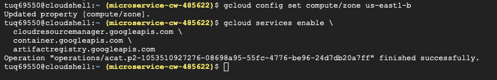

This screenshot shows the compute zone being configured. Completing this step first prevents permission or deployment issues later in the lab. It confirms that the environment is properly initialized before building any services.

---

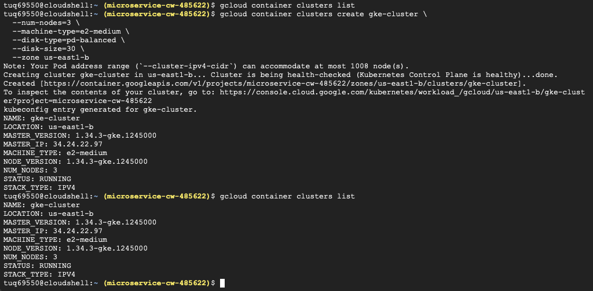

The Kubernetes cluster was successfully created with three nodes running in the specified zone. The output shows the cluster status as running. This verifies that the infrastructure is ready to host the microservices. Creating multiple nodes allows deployments to be distributed across the cluster. This step confirms that the foundation for all later deployment strategies is working correctly as it should be.

---

## Deployment Setup

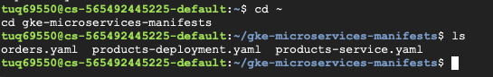

This screenshot shows navigating into the gke-microservices-manifests directory where the deployment YAML files are stored. The folder contains configuration files such as products-deployment.yaml and orders.yaml. Keeping these files organized in one location makes deployment easier and avoids command errors. Listing the directory confirms that all required manifests exist before running kubectl apply commands. This step ensures the correct files are ready to be deployed to Kubernetes.

---

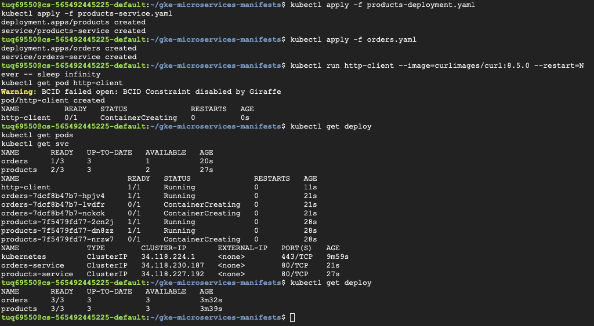

Both the products and orders deployments were applied successfully using kubectl commands. The output shows services being created and pods transitioning into Running status. Initially some pods were still in ContainerCreating state, which is normal while images are pulled and containers start. The deployment then reached 3/3 replicas, confirming everything initialized correctly. This establishes a working environment before testing updates.

---

## Updating the orders Service (v2)

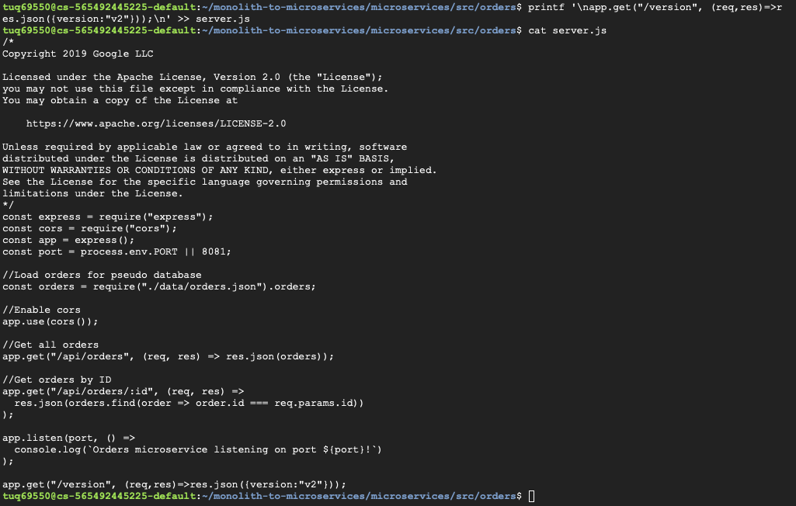

The server.js file was modified to include a new /version endpoint. This endpoint returns a JSON response showing the version number, which helps identify which deployment is serving requests. Adding this functionality allows verification during rolling updates, canary releases, and blue-green deployments. The screenshot shows the updated code appended to the file. This step is important because it creates a visible difference between v1 and v2 behavior.

---

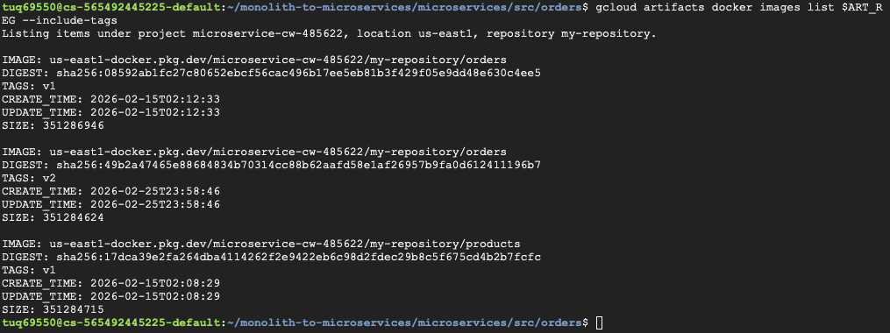

Artifact Registry displays multiple container images including orders:v1 and orders:v2. The presence of both versions confirms that the updated container image was built and pushed successfully. Each image shows metadata such as tags, digests, and timestamps. Having multiple versions available allows testing of different deployment strategies without rebuilding the application repeatedly. This step verifies that the container registry is correctly storing the application images.

---

## Rolling Update Deployment

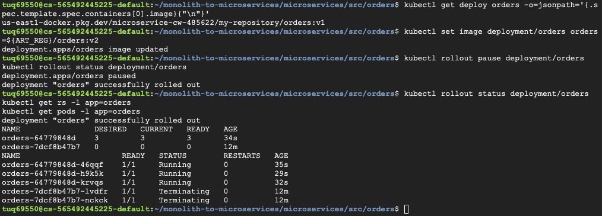

The deployment image was updated to orders:v2 and the rollout process was paused to observe behavior. Kubernetes began creating new pods while older pods remained active, demonstrating how rolling updates work gradually. The output shows deployment status messages and pod transitions. Pausing the rollout allowed inspection of the environment before completing the update. This demonstrates controlled deployment rather than an immediate full replacement.

---

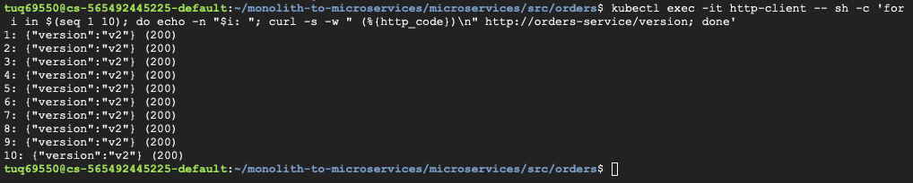

Requests were sent to the /version endpoint using the http-client pod. The responses returned version v2 with HTTP 200 status codes, confirming that traffic was routed to the updated pods. Testing from inside the cluster verifies internal service communication. Multiple requests were executed to confirm consistency. This step validates that the rolling update successfully deployed the new version.

---

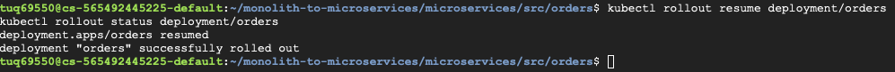

The paused rollout was resumed and completed successfully. Kubernetes finished updating all replicas automatically, replacing older pods with new ones. The deployment status confirms the rollout completed without downtime. This demonstrates how rolling updates maintain availability during application changes. Resuming the rollout finalizes the deployment process.

---

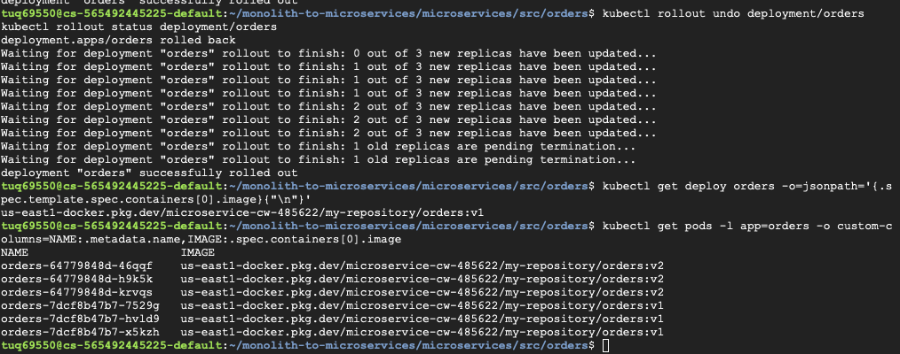

The deployment was rolled back to orders:v1 using kubectl rollout undo. During rollback, both v1 and v2 pods briefly existed while Kubernetes transitioned traffic safely. The output shows mixed images during the transition period. This demonstrates how rollback provides a quick recovery option if a deployment introduces issues. Successfully reverting confirms that version history is preserved.

---

## Canary Deployment

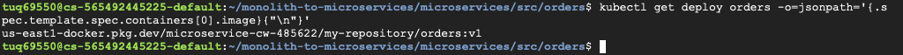

The active deployment image was verified before creating the canary deployment. Checking the current version ensures that the canary release starts from a stable baseline. This step helps avoid confusion when comparing v1 and v2 behavior. Verifying configuration before making changes is a best practice during deployments. It confirms the system state before introducing a new version.

---

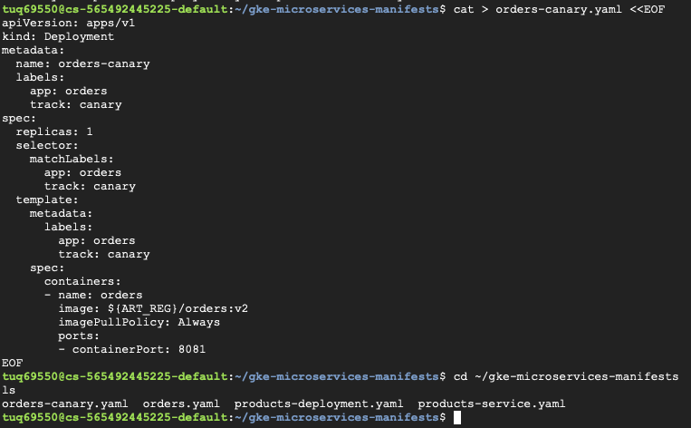

The orders-canary.yaml file was created to define a deployment with one replica running version v2. The configuration includes labels that identify the canary track separately from the main deployment. Creating a separate deployment allows only a small portion of traffic to reach the new version. This reduces risk while testing updates. The screenshot shows the YAML content used to configure the canary environment.

---

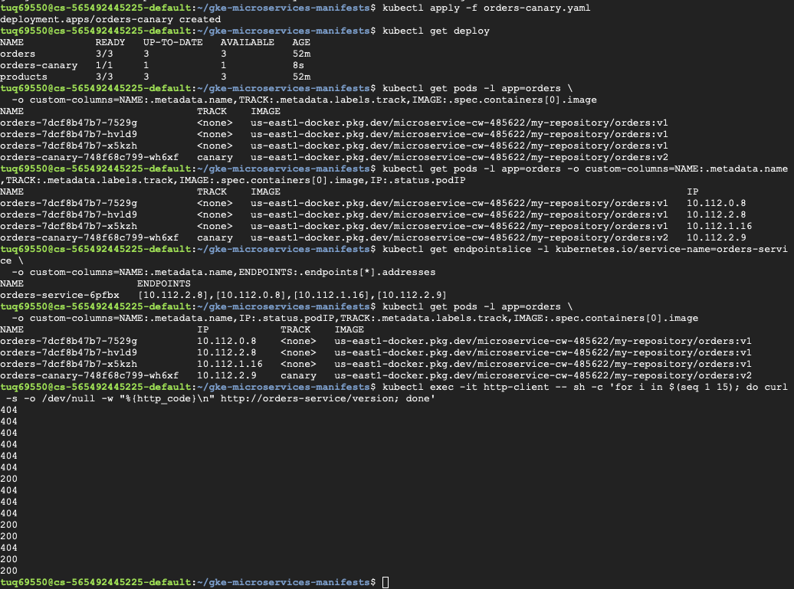

After applying the canary deployment, both stable and canary pods were visible in the cluster. The output shows track labels and image versions, confirming that v1 and v2 pods were running simultaneously. Traffic tests produced a mix of HTTP 404 and 200 responses, indicating requests were split between versions. This demonstrates the purpose of a canary release. Observing mixed responses confirms that only part of the traffic reached the new version.

---

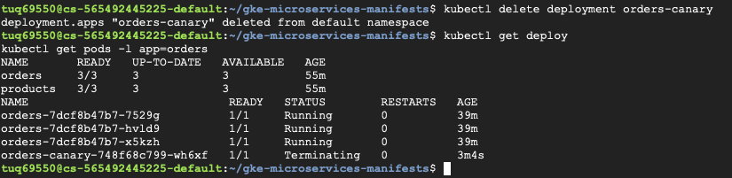

The canary deployment was deleted after testing was completed. The canary pod entered a Terminating state while the main deployment continued running normally. Kubernetes safely removed the temporary deployment without affecting service availability. Cleaning up unused deployments keeps the environment organized. This step concludes the canary testing phase.

---

## Blue-Green Deployment

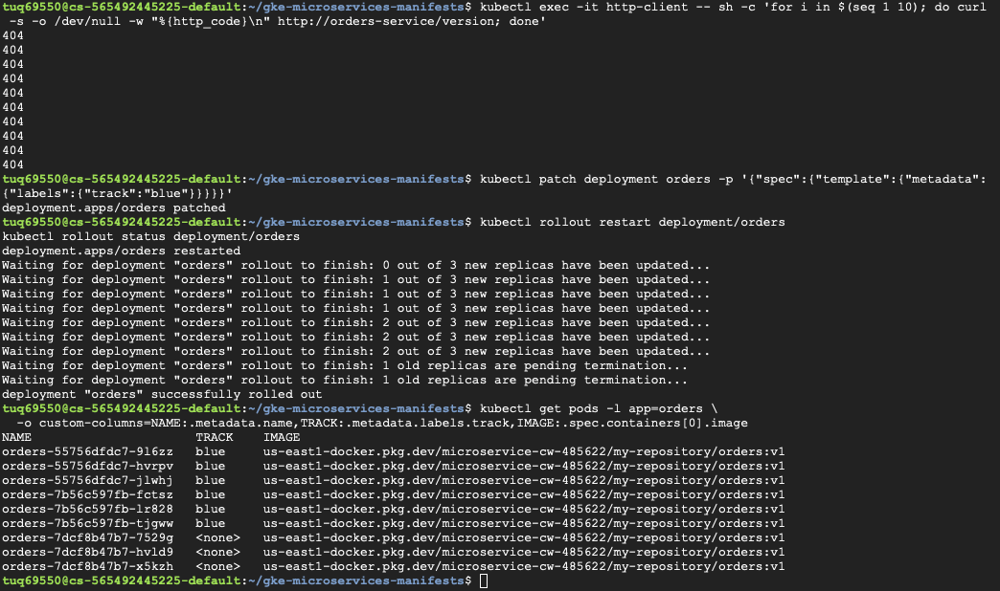

The orders deployment was labeled with track=blue and restarted to create the stable environment. Labeling pods allows the service selector to switch between blue and green deployments later. The rollout process replaced existing pods with labeled ones. This establishes the original version as the blue environment. Preparing labels is necessary before performing a blue-green switch.

---

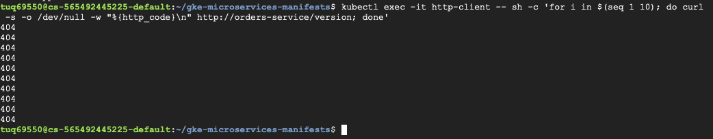

Testing the service returned only HTTP 404 responses, confirming traffic was still routed to version v1 in the blue environment. Running multiple requests ensured consistent results. Verifying behavior before switching environments prevents accidental traffic changes. This step confirms that the blue deployment remained stable. Establishing this baseline is important before introducing the green deployment.

---

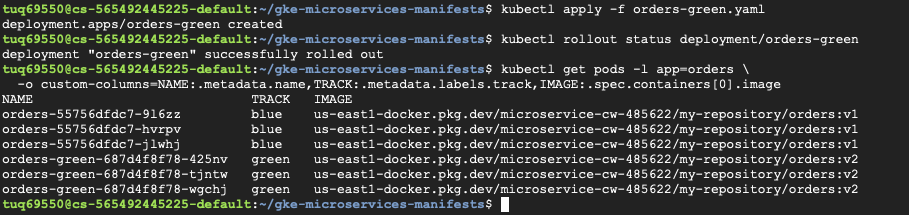

The green deployment was created using version v2 while the blue deployment continued running. The output shows pods with different track labels and image versions. Running both environments simultaneously allows testing without affecting the stable version. This demonstrates the core idea behind blue-green deployment strategies. Having both environments active enables instant switching.

---

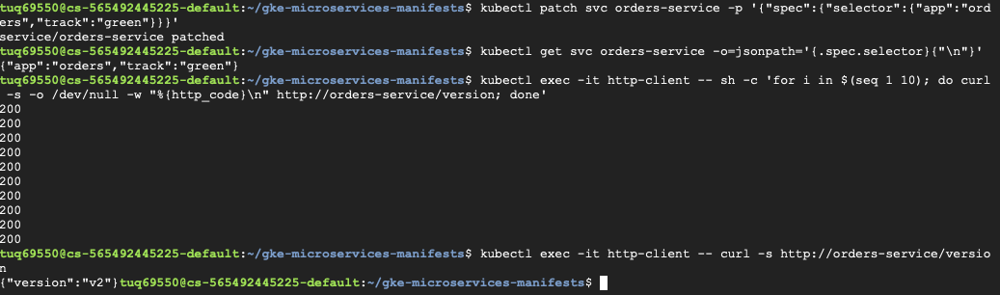

The service selector was patched to track=green, shifting traffic from blue to green pods. After the change, all requests returned version v2 responses with HTTP 200 status codes. This confirms the blue-green cutover was successful. Switching selectors instead of redeploying pods allows near-instant transitions. This step demonstrates how blue-green deployments minimize downtime during upgrades.

---

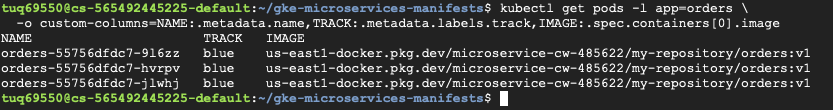

The Kubernetes cluster was deleted as part of the cleanup process. Removing cluster resources prevents unnecessary cloud usage and cost. The output confirms the deletion process completed successfully. Cleaning up infrastructure is an important final step after completing deployments. This marks the end of the lab environment.

---

## Deployment Strategy Diagrams

These diagrams show different Kubernetes deployment strategies and how traffic moves between versions during updates.

### Rolling Deployment
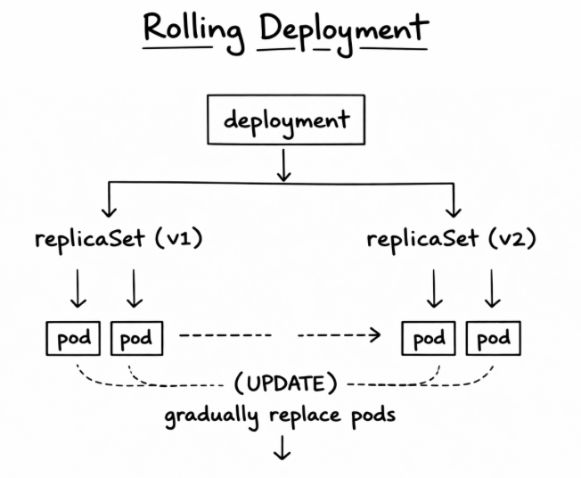

A rolling deployment gradually replaces old pods with new ones. The update happens step by step so the application stays available while new versions are introduced.

---

### Canary Deployment
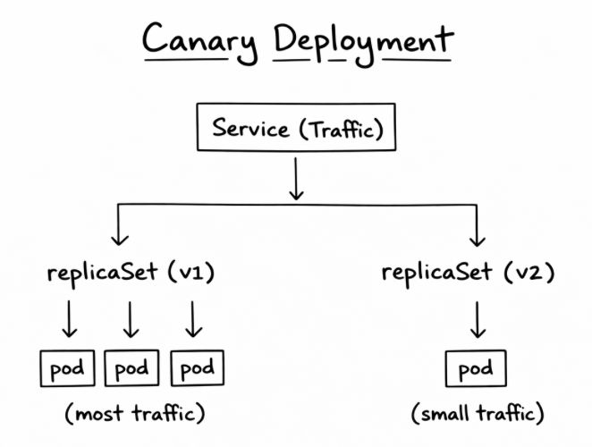

A canary deployment releases a new version to a small number of users first. Most traffic still goes to the stable version while the new version is tested for issues.

---

### Blue/Green Deployment
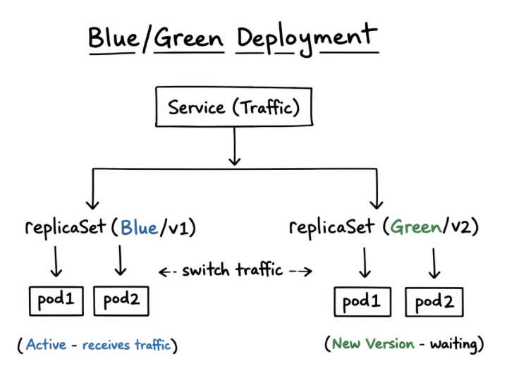

Blue/Green deployment runs two environments at the same time. Traffic switches from the old version (blue) to the new version (green) once the new version is ready.

---

### Dark Launch
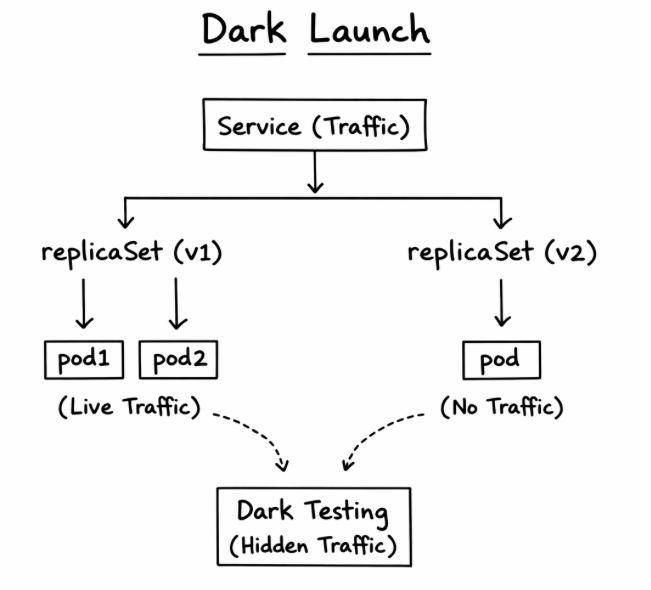

A dark launch deploys a new version without exposing it to normal users. The new version runs in the background for testing while live traffic continues going to the stable version.

---

## Reflection Questions

### 1. When is a rolling deployment appropriate?

A rolling deployment is good when the old and new versions can run at the same time without breaking anything. Kubernetes replaces pods little by little, so the app stays online while updates happen. I think this works best for smaller updates where you don’t expect major problems.

---

### 2. When would you choose a canary deployment instead of rolling?

I would use a canary deployment when I want to test a new version with only a small group of users first. Most traffic still goes to the stable version, which makes it safer if something goes wrong. It’s helpful when you’re not 100% sure how the update will behave.

---

### 3. What problem does blue/green deployment solve?

Blue/Green deployment helps avoid risk during releases because both versions exist at the same time. The new version can be fully ready before switching traffic. If something fails, you can quickly switch back to the old version, which makes it feel safer than updating everything at once.

---

### 4. What is the purpose of a dark launch?

A dark launch lets a new version run in the background without normal users seeing it. This makes it easier to test things like performance or logs without affecting real traffic. It’s basically like testing in production but without exposing the feature yet.

---

### 5. How do these strategies support independent microservice deployment?

These strategies make it easier to update one microservice without stopping the whole system. Instead of redeploying everything, you can control how traffic moves between versions. This makes updates safer and fits well with how microservices are supposed to work.

